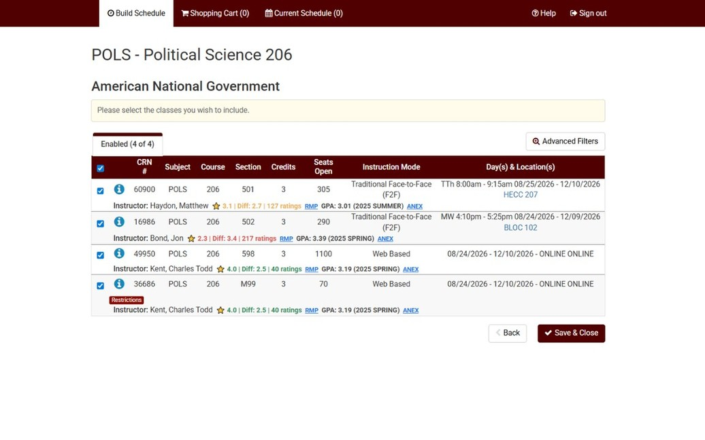

# AgRate

AgRate is a Chrome extension that injects professor ratings and GPA data directly into the Texas A&M Schedule Builder, so you can compare sections without leaving the page. It pulls RateMyProfessors ratings and ANEX grade distribution data, then displays them inline next to the instructor name.

Here is a sample of what the extension looks like:

I am currently getting this approved for the Chrome Web Store, so the steps below are the temporary install method. I will update this GitHub repo when the store listing is available.

**Features**

1. Inline RateMyProfessors rating, difficulty, and rating count.
2. Inline most recent GPA for the instructor and course (when available).
3. Links to the professor's RMP profile and the ANEX course page.
4. Local caching to reduce repeat requests and keep the UI fast.

**How It Works**

1. Detects instructor names in the Schedule Builder page.
2. Queries the RateMyProfessors GraphQL endpoint for matching instructors.
3. Queries ANEX for course GPA data by department and course number.
4. Injects the results into the page UI.

**Install (Developer Mode)**

1. Download the latest ZIP from:
   https://github.com/DavidQ1415/AgRate/releases/download/v1.0.0-beta/AgRate.zip
2. Unzip the download.
3. Open `chrome://extensions/` in Chrome.
4. Enable `Developer mode` (on the top right).
5. Click `Load unpacked` and select the unzipped `AgRate` folder
6. Open the Texas A&M Schedule Builder and search for classes.

**Data Sources**

1. RateMyProfessors (ratings and difficulty)
2. ANEX (Texas A&M grade distributions / GPA data)

**Notes**

1. The stats shown are for College Station, not Galveston.
2. Data can occasionally be incorrect or mismatched. Always click the RMP and ANEX links to verify the source data.

**Privacy**
AgRate only runs on the Schedule Builder site and sends requests to RateMyProfessors and ANEX to fetch data. It does not collect or store personal user data.

**Disclaimer**
This extension is not affiliated with or endorsed by Texas A&M University.
